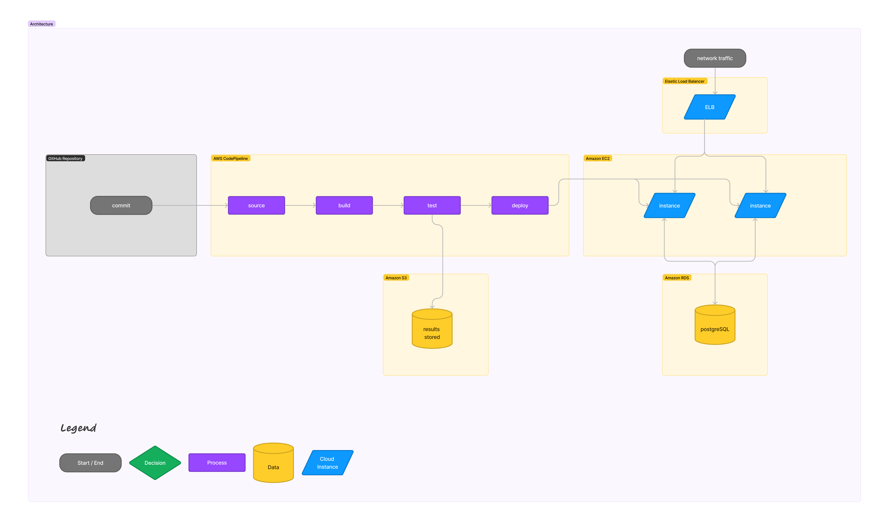

# Capstone Matching

## Developer Setup
1. install ruby version 3.2.2
2. install rails version 7.0.7.2
3. ```git clone git@github.com:Capstone-Matching/capstone-matching.git```
4. ```cd capstone-matching```
5. ```git config --global pull.rebase true```

## Developer Workflow
1. An issue will be assigned to you
2. Make a feature branch for an issue
3. When making a pull request back to ```main```, use the words ```Resolves <Issue #>``` in the title. For example, ```Resolves #123```
4. Wait for approval
5. Before merging the PR, ```git pull```.
6. Testcases will be run and code will be deployed onto the cloud

## Developer Run Ruby on Rails Project
1. ```cd capstone-matching```
2. ```bin/rails server -p 3000 -b 0.0.0.0```

## Deployment instructions (cloud only)
1. initialize ec2
2. walk through cloud-init.sh
3. bash start-script.sh

## Cloud Architecture



## Info
* Ruby version
3.2.2

* Rails version
7.0.7.2

* System dependencies

* Configuration

* Database creation

* Database initialization

* How to run the test suite

* Services (job queues, cache servers, search engines, etc.)

https://guides.rubyonrails.org/command_line.html

we will redeploy to heroku after completion

AWS Cloud9 is an optional IDE
